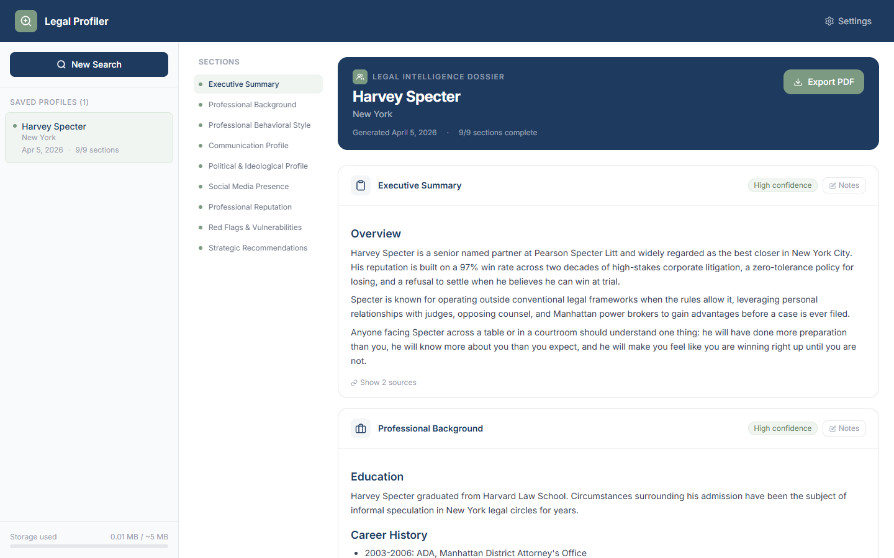
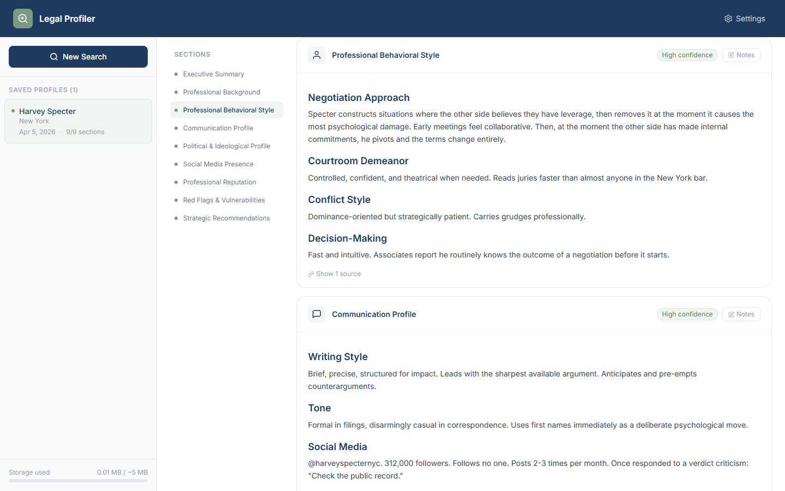
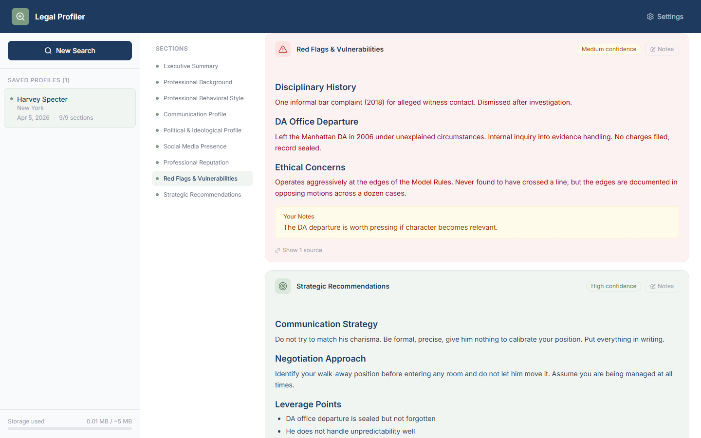
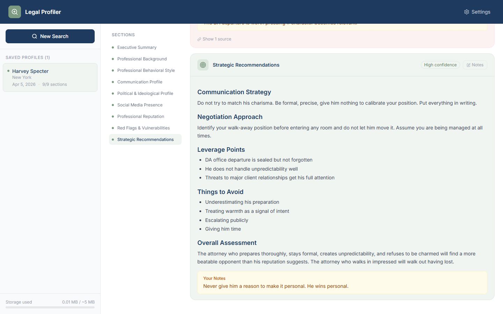
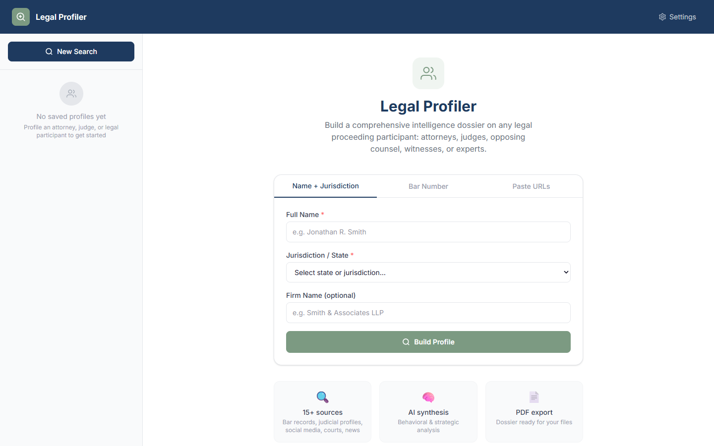
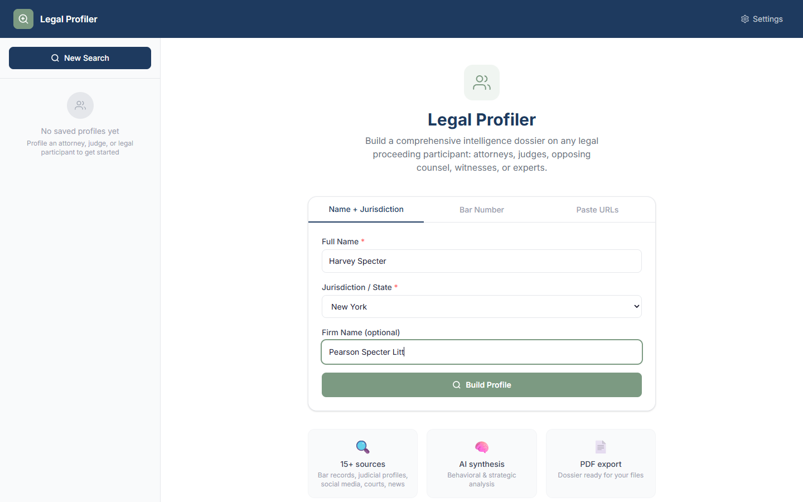

# Legal Profiler

A browser-based intelligence tool that builds comprehensive profiles on any legal proceeding participant: attorneys, judges, opposing counsel, expert witnesses, and more.

Built for litigators who need to know who they are dealing with before they communicate. Enter a name and jurisdiction, and Legal Profiler searches 15+ sources simultaneously, synthesizes everything into a structured dossier, and exports it as a clean PDF ready for your files.

---

## Screenshots

### Dossier Overview

The main dossier view shows the subject name, jurisdiction, and section completion status. Executive Summary and Professional Background load first and are visible immediately.



### Behavioral Style Section

The Professional Behavioral Style section breaks down negotiation tendencies, courtroom demeanor, conflict approach, and decision-making patterns based on publicly available information.



### Red Flags and Vulnerabilities

The Red Flags section surfaces disciplinary history, ethical complaints, and any documented concerns. Confidence level and inline notes are shown per section.



### Strategic Recommendations

The final section gives AI-generated guidance on how to approach, communicate with, and negotiate against the subject based on everything found.



### Search Form

The search form offers three entry points: name and jurisdiction, bar number, or paste URLs directly. The saved profiles list appears in the left sidebar.



### Search Form Filled

Name, jurisdiction, and firm name filled in and ready to run.



---

## What It Does

Walking into a negotiation, court appearance, or deposition without knowing who you are dealing with is a disadvantage. Legal Profiler removes that disadvantage.

Enter any attorney, judge, expert witness, or other legal participant. The app uses AI-powered web search to pull everything publicly available: bar records, court filings, social media, political donation history, peer reviews, disciplinary history, and news coverage. The AI synthesizes all of it into a structured nine-section dossier and tells you exactly how to approach the person strategically.

---

## Dossier Sections

Every profile is organized into nine sections:

1. **Executive Summary** - A concise overview of who this person is
2. **Professional Background** - Education, bar admissions, career history, practice areas, notable cases
3. **Professional Behavioral Style** - Negotiation tendencies, conflict approach, temperament under pressure, decision-making patterns
4. **Communication Profile** - Writing tone, formality level, response patterns, social media voice
5. **Political and Ideological Profile** - FEC donation records, public stances, judicial philosophy, social views
6. **Social Media Presence** - Platform-by-platform breakdown of activity, tone, interests, and connections
7. **Professional Reputation** - Avvo and Martindale-Hubbell ratings, peer reviews, bar standing, awards
8. **Red Flags and Vulnerabilities** - Disciplinary actions, sanctions, malpractice history, ethical complaints
9. **Strategic Recommendations** - AI-generated advice on how to approach, communicate, and negotiate with this person

---

## How It Works

### 1. Enter the Subject

Three ways to start a profile:

- **Name and Jurisdiction** - Enter a full name and select the state or federal circuit. The most common starting point.
- **Bar Number** - Enter a state bar number for a precise match when the name is common.
- **Paste URLs** - Drop in a LinkedIn profile, state bar page, Avvo listing, or any other URL. The AI analyzes those pages and expands outward from there.

### 2. AI-Powered Web Search

Once submitted, the AI model performs 10 to 15 targeted web searches across:

- State bar membership and disciplinary records
- LinkedIn, Twitter/X, and Facebook profiles
- Avvo and Martindale-Hubbell ratings
- FEC political donation records and state campaign finance filings
- Federal and state court case filings
- News coverage, verdicts, and press mentions
- Law review articles and published opinions
- Firm biographies and speaking engagements

The AI synthesizes everything it finds into the nine-section dossier structure.

### 3. Review and Annotate

Each section displays the AI-generated content with its source citations and a confidence rating. You can:

- Add your own notes to any section inline
- Expand source citations to see exactly where information came from
- Run a deep dive on any individual section for more focused research

### 4. Export as PDF

Click Export PDF to generate a multi-page formatted dossier. The PDF includes a cover page with subject name and jurisdiction, all nine sections with source citations, your personal notes, and a confidentiality footer on every page.

---

## Getting Started

### Prerequisites

- An API key for Anthropic (Claude) or OpenAI (GPT-4o)
- A modern browser (Chrome, Edge, Firefox, Safari)

### Run from Source

```bash
git clone https://github.com/yourname/legal-profiler.git
cd legal-profiler
npm install
npm run dev
```

Open `http://localhost:5173` in your browser.

### First-Time Setup

1. Click Settings in the top right
2. Select your AI provider (Anthropic or OpenAI)
3. Paste your API key
4. Click Test Connection to confirm it works
5. Select your preferred model
6. Close Settings and enter a name to start your first profile

---

## AI Model Options

| Provider | Models | What You Need |
|---|---|---|
| Anthropic | Claude Sonnet 4.6, Claude Opus 4.6, Claude Haiku 4.5 | Anthropic API key |
| OpenAI | GPT-4o, GPT-4o Mini | OpenAI API key |
| Custom / Local | Any OpenAI-compatible endpoint | Endpoint URL + Serper.dev key |

Claude Sonnet 4.6 is recommended as the default. It has native web search, strong reasoning for behavioral analysis, and a good balance of speed and depth. Claude Opus 4.6 produces more thorough output at higher cost. GPT-4o is a strong alternative.

For custom or local models without native web search, a Serper.dev API key is required to power the search layer.

---

## Sources Searched

| Category | Sources |
|---|---|
| Bar records | State bar websites, bar admission databases, disciplinary boards |
| Court records | PACER, state court dockets, published opinions |
| Ratings | Avvo, Martindale-Hubbell, Super Lawyers |
| Social media | LinkedIn, Twitter/X, Facebook |
| Political | FEC donor database, state campaign finance filings |
| News | General web news, legal industry publications |
| Publications | Law reviews, bar journals, firm client alerts |
| Firm bios | Law firm websites, attorney directory pages |

---

## Privacy

All searches run through the AI provider you configure. No data is sent to any server operated by this application. Profiles are saved to your browser's local storage only and never leave your device.

API keys are stored in your browser's local storage. They are never transmitted anywhere except directly to the AI provider you select.

---

## Tech Stack

- React 19 + Vite 8
- Tailwind CSS v4
- Zustand for state management
- jsPDF and jspdf-autotable for PDF export
- Anthropic Messages API with web search tool
- OpenAI Responses API with web search tool
- Serper.dev for fallback search

---

## Roadmap

- PACER direct integration for federal case lookup
- State bar API integrations for real-time bar status
- Side-by-side profile comparison
- Team sharing and collaborative annotation
- Profile refresh with change detection
- Export to Word document format
- Calendar integration to auto-suggest profiles before hearings
